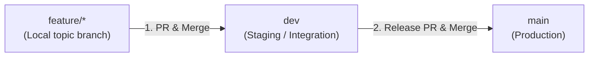

# Contributing & Git Workflow Guide

This document outlines the branching model, GitHub merge strategies, and best practices for developing and releasing features in **conmeet.moe**. Following these guidelines prevents branch divergence, `CONFLICT (add/add)` merge conflicts, and editor sync lockups.

---

## 1. Branch Structure & Roles

| Branch | Role | Protection | Permitted Direct Changes |
| :--- | :--- | :--- | :--- |
| **`main`** | **Production**: Represents live, production-ready code. | **Protected** (No force-push, PR required) | Releases from `dev` or critical `hotfix/*` |
| **`dev`** | **Integration / Staging**: Ongoing work for upcoming release. | **Protected** (No force-push) | Feature PR merges |
| **`feature/*`** | **Topic branches**: New features, UI updates, bug fixes. | None | Active development by author |
| **`hotfix/*`** | **Urgent production fixes**: Cut directly from `main`. | None | Urgent production bug fixes |

---

## 2. Unidirectional Promotion Model

Code flows in **one direction**:



> [!IMPORTANT]
> **The Golden Rule**:
> - **Never** merge a `feature/*` branch directly into `main` while working against `dev`.
> - **Never** open two separate PRs with the same changes to both `dev` and `main`.
> - All features integrate into `dev` first. When ready for release, `dev` is promoted to `main`.

---

## 3. GitHub PR Merge Rules

When merging Pull Requests on GitHub, adhere to these strategy rules:

### A. Feature &rarr; `dev`
- **Allowed**: **Squash and merge** OR **Create a merge commit**.
- Squash-merging individual features into `dev` keeps `dev` history concise and readable.

### B. `dev` &rarr; `main` (Release PRs)
- **MUST USE**: **Create a merge commit** (or fast-forward).
- **NEVER** use **Squash and merge** when merging `dev` into `main`!
  - *Why?* Squashing `dev` into `main` creates a brand-new single commit on `main` that does not exist in `dev`. This causes their commit histories to diverge, guaranteeing that all future PRs from `dev` into `main` will conflict with `CONFLICT (add/add)`.

---

## 4. Day-to-Day Workflow

### Step 1: Start a New Feature
Always pull the latest `dev` before starting new work:
```bash
git checkout dev
git pull origin dev
git checkout -b feature/your-feature-name
```

### Step 2: Develop & Commit
Work and make your commits as usual:
```bash
git add <files>
git commit -m "Describe feature changes"
```

### Step 3: Keep Your Feature Branch Updated
If other features have merged into `dev` while you were working:
```bash
git checkout feature/your-feature-name
git fetch origin
git merge origin/dev
# or: git rebase origin/dev (rebasing on your own private branch is safe)
```

### Step 4: Open a PR to `dev`
1. Push your branch to GitHub:
   ```bash
   git push -u origin feature/your-feature-name
   ```
2. Open a Pull Request targeting **base: `dev`** (NOT `main`).
3. Once reviewed and tests pass, merge into `dev`.

### Step 5: Clean Up Local Branches
After your PR is merged into `dev`:
```bash
git checkout dev
git pull origin dev
git branch -d feature/your-feature-name
git remote prune origin
```

---

## 5. Branch Hygiene & Protection Rules

1. **Never rebase or force-push `dev` or `main`**:
   - `dev` and `main` are shared, protected branches.
   - Rebasing rewrites commit hashes, requiring a `--force` push which GitHub will reject (`GH006: Protected branch update failed`).
   - If your local branch gets out of sync, use a standard merge commit instead of rewriting history.
2. **Do not use VS Code / IDE "Sync Changes" after an interactive rebase**:
   - If a rebase occurs, "Sync Changes" will attempt to pull/push divergent commits and get stuck.

---

## 6. Hotfixes to `main` (Emergency Fixes)

If a critical bug must be fixed directly in production without waiting for the full `dev` cycle:

1. **Branch off `main`**:
   ```bash
   git checkout main
   git pull origin main
   git checkout -b hotfix/critical-fix
   ```
2. **Fix, commit, and PR to `main`**:
   - Open PR targeting `main`.
   - Merge PR using **Create a merge commit**.
3. **Immediately backport to `dev`**:
   - To keep `dev` and `main` in sync, merge `main` into `dev`:
     ```bash
     git checkout dev
     git pull origin dev
     git merge origin/main -m "Backport hotfix from main into dev"
     git push origin dev
     ```

---

## 7. Troubleshooting

### Problem: "Sync Changes" is stuck or GitHub reports protected branch update failed
**Cause**: Local `dev` was rebased or reset, causing commit hashes to diverge from `origin/dev`.
**Fix**:
1. Reset local `dev` to match remote:
   ```bash
   git checkout dev
   git fetch origin
   git reset --hard origin/dev
   ```
2. If you need to integrate changes from `main` into `dev`, use a standard merge commit instead of rebasing:
   ```bash
   git merge origin/main -m "Merge branch 'main' into dev"
   git push origin dev
   ```

### Problem: GitHub PR from `dev` to `main` shows conflicts on unchanged files (`add/add`)
**Cause**: A feature was squashed into `main` separately or histories diverged.
**Fix**:
1. Ensure both branches are fetched:
   ```bash
   git fetch origin
   ```
2. Create a merge commit joining `dev` and `origin/main` preserving `dev`'s tree state:
   ```bash
   git checkout dev
   COMMIT_ID=$(git commit-tree dev^{tree} -p dev -p origin/main -m "Merge branch 'main' into dev")
   git merge --ff-only $COMMIT_ID
   git push origin dev
   ```
3. The PR on GitHub will immediately update to "Able to merge".
